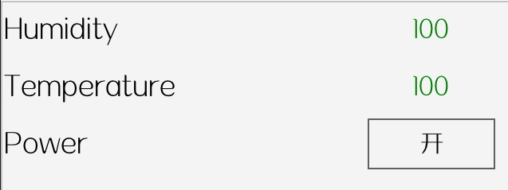

# awtk-widget-title-value

title_value 控件。



在只有两个方向键和 OK 键时的硬件平台，两个方向键既要用来切换焦点，又要用来修改控件的值。本控件主要用来解决这个问题：

* 1. 先用方向键切换焦点，切换到指定的控件。
* 2. 再按 OK 键进入编辑状态，此时用方向键修改值。
* 3. 完成后按 OK 键，退出编辑状态。
* 4. 方向键继续用于切换焦点。

> 请在底层把 OK 键映射到 TK_KEY_RETURN 键值。

## 准备

1. 获取 awtk 并编译

```
git clone https://github.com/zlgopen/awtk.git
cd awtk; scons; cd -
```

2. 获取 awtk-widget-number-label 并编译

```
git clone https://github.com/zlgopen/awtk-widget-number-label.git
cd awtk-widget-number-label; scons; cd -
```

## 运行

1. 生成示例代码的资源

```
python scripts/update_res.py all
```
> 也可以使用 Designer 打开项目，之后点击 “打包” 按钮进行生成；
> 如果资源发生修改，则需要重新生成资源。

如果 PIL 没有安装，执行上述脚本可能会出现如下错误：
```cmd
Traceback (most recent call last):
...
ModuleNotFoundError: No module named 'PIL'
```
请用 pip 安装：
```cmd
pip install Pillow
```

2. 编译

* 编译 PC 版本

```
scons
```

* 编译 LINUX FB 版本

```
scons LINUX_FB=true
```

> 完整编译选项请参考 [编译选项](https://github.com/zlgopen/awtk-widget-generator/blob/master/docs/build_options.md)

3. 运行

```
./bin/demo
```

## 文档

[完善自定义控件](https://github.com/zlgopen/awtk-widget-generator/blob/master/docs/improve_generated_widget.md)
